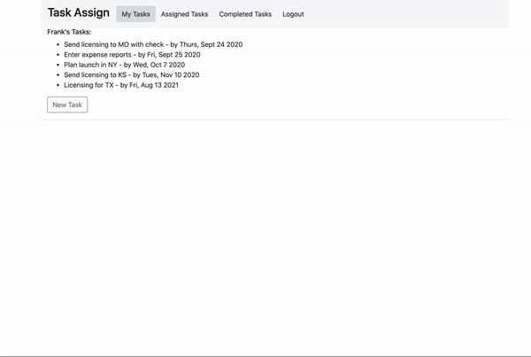

This project was bootstrapped with [Create React App](https://github.com/facebook/create-react-app).

## README

### Task Assign

Task Assign is a task management app that allows you to create tasks with due dates, and comments. You can assign tasks to other users and track the progress on those tasks. You can also view your completed tasks. Overdue tasks are indicated in red type.

To create a task, click the 'New Task' button and fill out the task form. You do not need to select a user if the task is assigned to yourself

Click on the task to view the details of a task, edit a task (by clicking on the pencil), comment on a task, or to mark as complete.

### Usage

To run, copy the repo and run yarn install and run yarn start and [http://localhost:3000](http://localhost:3000) will open in the browser.
 
Run the backend by going to (https://github.com/fdreith/react-project-backend), copy the repo and run bundle install, and rails s to start the server on [http://localhost:3001](http://localhost:3001). 

## License

MIT License

Copyright (c) <2020> fdreith

Permission is hereby granted, free of charge, to any person obtaining a copy of this software and associated documentation files (the "Software"), to deal in the Software without restriction, including without limitation the rights to use, copy, modify, merge, publish, distribute, sublicense, and/or sell copies of the Software, and to permit persons to whom the Software is furnished to do so, subject to the following conditions:

The above copyright notice and this permission notice shall be included in all copies or substantial portions of the Software.

THE SOFTWARE IS PROVIDED "AS IS", WITHOUT WARRANTY OF ANY KIND, EXPRESS OR IMPLIED, INCLUDING BUT NOT LIMITED TO THE WARRANTIES OF MERCHANTABILITY, FITNESS FOR A PARTICULAR PURPOSE AND NONINFRINGEMENT. IN NO EVENT SHALL THE AUTHORS OR COPYRIGHT HOLDERS BE LIABLE FOR ANY CLAIM, DAMAGES OR OTHER LIABILITY, WHETHER IN AN ACTION OF CONTRACT, TORT OR OTHERWISE, ARISING FROM, OUT OF OR IN CONNECTION WITH THE SOFTWARE OR THE USE OR OTHER DEALINGS IN THE SOFTWARE.
